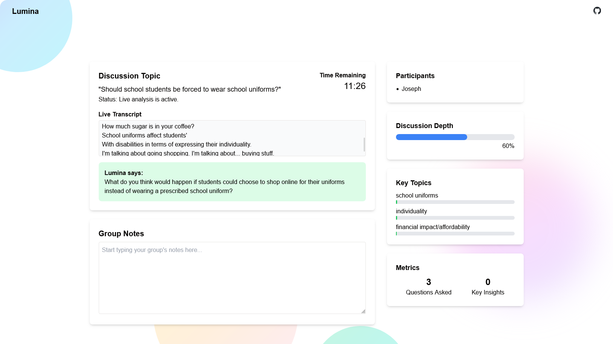
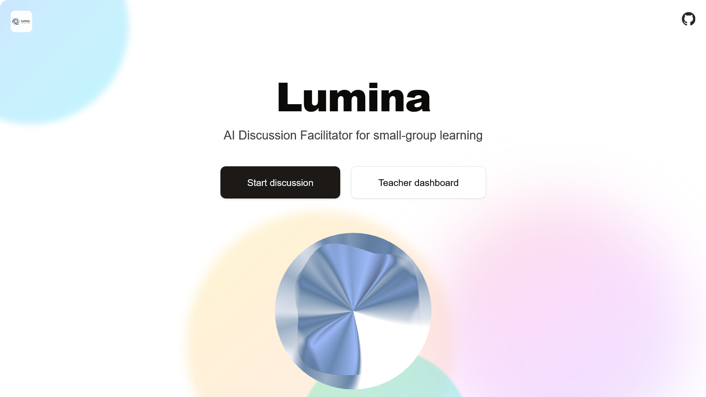

<div align="center">
   <!-- Logo -->
  <h1>Lumina</h1>
  <p>
    Real-time AI agent that facilitates classroom discussions with voice interventions, keeping students engaged.
  </p>
  <p>
    Built With:
    <a href="https://nextjs.org">Next.js</a> &bull;
    <a href="https://github.com/websockets/ws">WebSocket</a> &bull;
    <a href="https://ai-sdk.dev">Vercel AI SDK</a> &bull;
    <a href="https://elevenlabs.io/app/agents">ElevenLabs Agents Platform</a> &bull;
    <a href="https://groq.com">Groq</a> &bull;
    <a href="https://tailwindcss.com">Tailwind CSS</a> &bull;
    <a href="https://gsap.com">GSAP</a>
  </p>
</div>

---

<details>
<summary>Table of Contents</summary>

- [About](#about)
- [Demo](#demo)
- [Getting Started](#getting-started)
  - [Prerequisites](#prerequisites)
  - [Installation](#installation)
  - [Execution](#execution)
- [Usage](#usage)
</details>

## About

<div align=center></div>

Lumina is our submission for <a href="https://luma.com/cursor-hack-sg">Cursor Hackathon Singapore</a>, an AI-powered facilitator for classroom discussions. We created a voice-activated agent that analyzes student conversations real-time & provides supportive intervention to keep them on-topic & engaged.

**Core Features:**

1. **Real-Time Analysis**: Uses Groq to transcribe and analyze live audio, detecting off-topic discussions, silence, or imbalanced participation.
2. **AI-Powered Interventions**: Uses ElevenLabs to provide gentle nudges via questions for silences or off-topic discussions.
3. **Live Teacher Dashboard**: Dashboard via WebSocket gives teachers a high-level overview of all groups & alerts them when a group requires support.

## Demo

<div align=center>
  <a href="https://youtu.be/LJ635aIQi2M">
    
  </a>
  <p>
    <em>Click to watch our hackathon demo on YouTube</em>
  </p>
</div>

## Getting Started

### Prerequisites

**Getting API keys:**

1. **ElevenLabs:**
   1. Create an [Agent](https://elevenlabs.io/app/agents/agents) to get your AGENT_ID.
   2. Create an [API Key](https://elevenlabs.io/app/developers/api-keys) for ELEVENLABS_API_KEY with the following permissions:
      - Text to Speech
      - Speech to Text
      - Audio Isolation
      - ElevenLabs Agents: Write
2. **Groq:**
   1. Create an [API Key](https://console.groq.com/keys) for GROQ_API_KEY.

### Installation

1. Install dependencies:
   ```sh
   bun i
   ```
2. Set up environment variables:
   ```env
   AGENT_ID=
   ELEVENLABS_API_KEY=
   GROQ_API_KEY=
   ```

### Execution

1. Start WebSocket server:
   ```sh
   bun run websocket-server.js
   ```
2. Run the app:
   ```sh
   bun run dev
   ```
   Access the app at `http://localhost:3000`.

## Usage

1. **Student Discussion View (`/`)**
   - Backend transcribes the audio & analyzes the conversation for 2 triggers:
     1. **Prolonged Silence**: If no speech is detected for a set period, Lumina asks a question to re-engage students.
     2. **Off-topic**: If the conversation goes off-topic, Lumina creates a guiding question (including the off-topic topic) to bring the discussion back on track.
2. **Teacher Dashboard (`/teacher/dashboard`)**
   - When Lumina makes a verbal intervention in a student group, an alert is pushed to the teacher dashboard.

## License <!-- omit in toc -->

Distributed under the MIT License.

## Credits <!-- omit in toc -->

- [adore_blvnk](https://x.com/adore_blvnk)
- [Lance](linkedin.com/in/lance-tan)

## Acknowledgements  <!-- omit in toc -->

<!-- Inspired by Best-README-Template (https://github.com/othneildrew/Best-README-Template) -->
<!-- Table of Contents generated by Markdown All in One (https://github.com/yzhang-gh/vscode-markdown) -->

<!-- Helpful notes:
- insert a centred image:
  <div align=center></div>
-->
